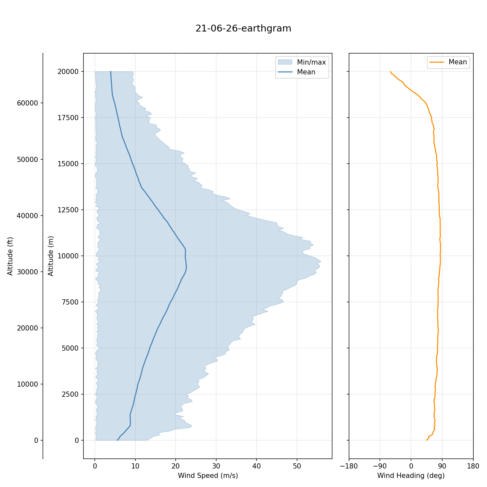

# windgen

Wind profile ensemble generator meant for use with the [Leeds Flight Simulator](https://github.com/leedsrocketry/leeds-flight-simulator). Generates `.npz` ensembles of perturbed wind profiles from EarthGRAM 2024 climatology, GFS/ECMWF/UKV forecasts, and radiosonde measurements — covering every stage of a launch campaign from safety case preparation to launch-day go/no-go.

Built for the Gryphon II Block II (G2B2) campaign by the Leeds University Rocketry Association (LURA).



---

## Table of Contents

- [Installation](#installation)
- [Quick Start](#quick-start)
- [Commands](#commands)
  - [generate](#generate)
  - [fetch](#fetch)
  - [preview](#preview)
- [Output Format](#output-format)
- [Operational Workflow](#operational-workflow)
- [File Layout](#file-layout)
- [EarthGRAM Setup](#earthgram-setup)
- [Contact](#contact)

---

## Installation

**Prerequisites:** Python 3.10+, EarthGRAM 2024 runtime (see [EarthGRAM Setup](#earthgram-setup)).

```
pip install numpy matplotlib pyyaml click rich
```

Optional — only needed if using the corresponding forecast source:

```
pip install cfgrib xarray    # GFS
pip install netCDF4           # ECMWF
```

## Quick Start

Run from the `windgen/` directory. All commands use `python .` as the entry point.

```bash
# Generate a climatology ensemble for a single date
python . generate ../simulations/cases/g2b2-cape-wrath/config.yaml 21-06-26

# Generate a climatology ensemble for a date range (uses midpoint)
python . generate ../simulations/cases/g2b2-cape-wrath/config.yaml 15-06-26 28-06-26

# Preview the result
python . preview ../simulations/cases/g2b2-cape-wrath/wind/21-06-26-earthgram.npz
```

Then point LFS at the output by setting `launch.wind_profiles` in `config.yaml`:

```yaml
launch:
  wind_profiles: "wind/21-06-26-earthgram.npz"
```


## Commands

### `generate`

```
python . generate CONFIG [DATE] [DATE_END] [OPTIONS]
```

Generates a perturbed wind profile ensemble (`.npz`) via EarthGRAM.

**Two modes:**

| Mode | Trigger | Date source | Typical use |
|------|---------|-------------|-------------|
| Climatology | No `--mean` | `DATE` (required), optional `DATE_END` | Safety case — months before launch |
| Mean profile | `--mean PATH` | Parsed from mean profile filename(s) | Ops planning / go-no-go — days or hours before |

**Climatology date ranges:** When `DATE_END` is provided, a single ensemble is generated for the midpoint of the range (climatological statistics barely shift over short windows). A warning is emitted if the range exceeds 14 days.

**Mean profile mode:** `--mean` accepts a single `.npz` file or a directory of `.npz` files. One ensemble is generated per file, with dates and source names taken from filenames. `DATE_END` is not permitted in this mode.

**Options:**

| Flag | Default | Description |
|------|---------|-------------|
| `--mean PATH` | — | Mean wind profile `.npz` or directory of `.npz` files (from `fetch` or radiosonde). Omit for climatology. |
| `--perturbation-scale` | `1.0` | Perturbation magnitude (0.0 = deterministic, 1.0 = full variability) |
| `--n-profiles` | from config | Ensemble size. Read from `monte_carlo.samples` in config if not given. |
| `--master-seed` | from config | Master random seed. Read from `monte_carlo.seed` in config if not given. |
| `--altitude-max` | `20000` | Maximum altitude in metres AGL |
| `--altitude-step` | `250` | Altitude grid spacing in metres |
| `-q` / `--no-popup` | off | Save preview PNGs to disk instead of opening matplotlib windows |

**Output:** Written to `wind/` relative to the config file. Filename is `{DD-MM-YY}-{source}.npz` (e.g. `wind/21-06-26-earthgram.npz`).


### `fetch`

```
python . fetch CONFIG --source SOURCE DATE [DATE_END]
```

Downloads forecast mean wind profiles and saves one `.npz` per day (N=1 profile each).

| Option | Description |
|--------|-------------|
| `--source` | `gfs`, `ecmwf`, or `ukv` (required) |

**Output:** Written to `wind/mean/` relative to the config file, named `{DD-MM-YY}-{source}.npz`.

This is the only command that requires internet access. The resulting mean profiles are then fed to `generate --mean` to produce perturbed ensembles.


### `preview`

```
python . preview TARGET [-q]
```

Plots wind profiles from a `.npz` file or a directory of `.npz` files. Shows mean wind speed with min/max envelope and mean wind heading vs altitude (metres and feet).

| Option | Description |
|--------|-------------|
| `-q` / `--no-popup` | Save PNGs alongside the `.npz` files instead of displaying interactively |


## Output Format

All commands produce NumPy `.npz` archives with:

| Key | Shape | Description |
|-----|-------|-------------|
| `altitude_m` | `(M,)` | Altitude grid in metres AGL, monotonically increasing |
| `wind_east_ms` | `(N, M)` | Eastward wind component per profile (m/s) |
| `wind_north_ms` | `(N, M)` | Northward wind component per profile (m/s) |
| `metadata` | string | JSON: source, timestamp, site, perturbation scale, ensemble size |

`N` = number of profiles (1 for `fetch`, typically 1000 for `generate`). `M` = altitude grid points (typically 81 for 0–20,000 m at 250 m). LFS loads these via `wind.py` without knowledge of the source.


## Operational Workflow

| Campaign stage | Command | Notes |
|----------------|---------|-------|
| Safety case (months before) | `python . generate CONFIG 15-06-26 28-06-26` | EarthGRAM climatology, full perturbation, midpoint date |
| Ops planning (days before) | `python . fetch CONFIG --source gfs 12-07-26 14-07-26` | Download forecast means |
| | `python . generate CONFIG --mean wind/mean/` | Perturb all fetched means |
| Go/no-go (hours before) | `python . generate CONFIG --mean wind/mean/sounding.npz` | Radiosonde as mean input |
| Debugging | `python . generate CONFIG 21-06-26 --perturbation-scale 0.0` | All profiles identical |
| Visual check | `python . preview wind/` | Inspect before running LFS |

After generating, update `launch.wind_profiles` in `config.yaml` to point at the chosen ensemble, then run LFS.


## File Layout

```
simulations/cases/g2b2-cape-wrath/
├── config.yaml
├── wind/
│   ├── mean/                        # fetch output (N=1 mean profiles)
│   │   ├── 12-07-26-gfs.npz
│   │   └── 13-07-26-gfs.npz
│   ├── 21-06-26-earthgram.npz      # generate output (perturbed ensembles)
│   ├── 12-07-26-gfs.npz
│   └── ...
└── results/
```


## EarthGRAM Setup

The `earthgram/` directory (gitignored, ~480 MB) contains NASA's EarthGRAM 2024 runtime: prebuilt Windows executable, SPICE kernels, and NCEP climatology data. It is not redistributable.

**To set up:**

1. Obtain the `earthgram/` archive from the LURA OneDrive (`team-member-space/Nick/earthgram/`).
2. Place it at `windgen/earthgram/` so that `windgen/earthgram/bin/EarthGRAM.exe` exists.

No compilation required — windgen invokes `EarthGRAM.exe` via subprocess.


## Contact

- **Toby Thomson** — el21tbt@leeds.ac.uk, me@tobythomson.co.uk
- **LURA Team** — launch@leedsrocketry.co.uk
